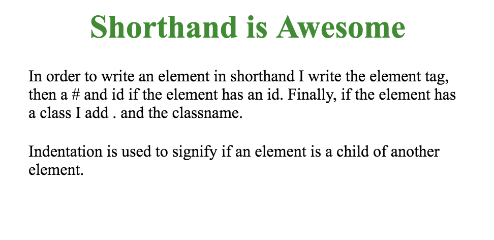
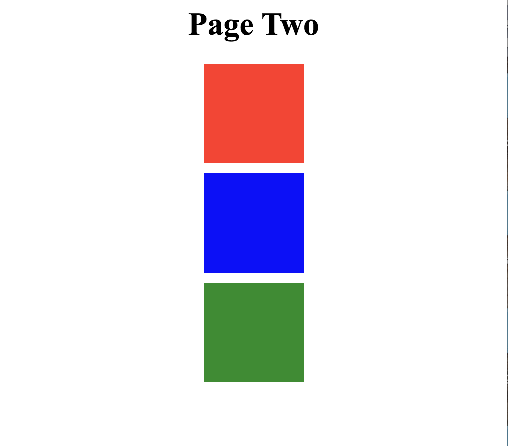
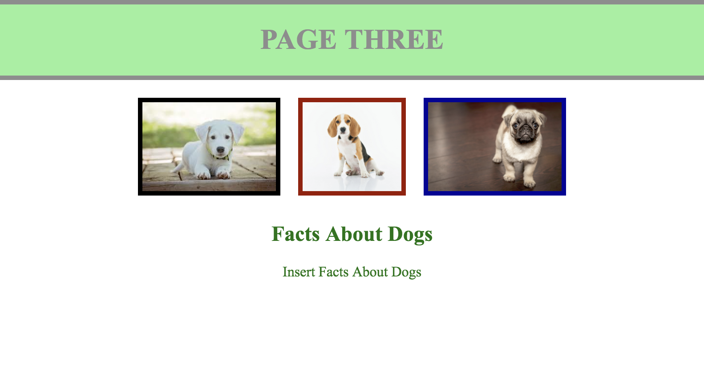
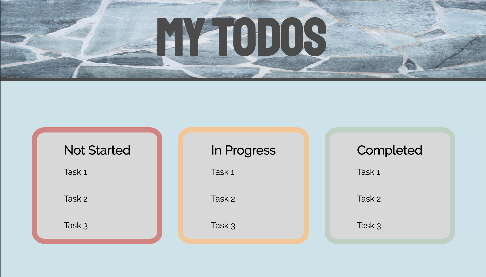

# Shorthand Converter

## The Goal
In this lab we'll be looking at how to convert short hand and english explanations of html components into actual html code. This will be extremely useful as we move further in the course as it will allow us to easily and succinctly describe html elements in a consistent way.

# The Lab

#### Introduction to Shorthand

## Page One:
To start off, were going to add some simple HTML tags to the index1.html file. These tags will not have classes or ids yet. Remember, the first part of shorthand is just the tag name! An image of what your final page will look like is below the shorthand!

**HTML Shorthand:**

h1  
p  
p  

## Page Two:
As you may have seen in the last one, without classes and ids it's harder to get the specific styles that we want to see. On this page, lets step up our html with elements that have ids and classes. Add the html elements described by the shorthand below to the index2.html file. If you place all of the correct elements in the index2.html file they will be correctly styled by style2.css. The picture below is the end product you're working towards! Fill in the text for any text elements as needed.

**HTML Shorthand:**

h1#title  
div#red.box  
div#blue.box  
div#green.box  

## Page Three:
Now that you've written some HTML elements with specific classes and ids, let's get into some nested elements! Pay attention to the indentation of the HTML Shorthand written below when you're filling in index3.html. The picture below the shorthand is what your page should look like when you're finished! Fill in the src attributes for the image elements and text for text elements to match the page! You should see the necessary puppy images in this folder.

**HTML Shorthand:**

div#header  
\*\*\* h1#title 
div.pictures 
\*\*\* img#puppy1.puppy 
\*\*\* img#puppy2.puppy 
\*\*\* img#puppy3.puppy 
div.info 
\*\*\* h2 
\*\*\* p

## Page Four:
Now that you've made it this far, let's stretch with some even more nesting and elements! Add all of the elements you see below to the index4.html page. When all of the elements have been added your page will look like the one below the html shorthand. Use the background.jpg file as the source for the img.background-image element.

div#header.area  
\*\*\* img.background-image  
\*\*\*   h1#title  
div#body.area  
\*\*\*   div#notstarted.todolist  
\*\*\*\*\*\*     h2.taskTitle  
\*\*\*\*\*\*     p.task  
\*\*\*\*\*\*     p.task  
\*\*\*\*\*\*     p.task  
\*\*\* div#inprogress.todolist  
\*\*\*\*\*\*     h2.taskTitle  
\*\*\*\*\*\*     p.task  
\*\*\*\*\*\*     p.task  
\*\*\*\*\*\*     p.task  
\*\*\* div#complete.todolist  
\*\*\*\*\*\*     h2.taskTitle  
\*\*\*\*\*\*     p.task  
\*\*\*\*\*\*     p.task  
\*\*\*\*\*\*     p.task  

## Extension - include this on page four

1. Complete this with your elbow partner in class.
2. Take a few minutes to come up with three additional html elements and style them in your own code for one of the files or start a new file completely. Use HTML comments to clearly label this area in your page.
3. Write down the shorthand explanations of the html that you've added to your page.
4. Send your partner the css rules to add and the shorthand explanation of the html that you want them to create. (If you want to make an added challenge, try to describe the selectors and rules that they need to complete in english also. For example: "select all h1 elements and color them green")
5. Add the html elements and css rules that your partner described with shorthand and gave to you! Use comments to clearly label this area in your page.
6. Add a commented description of this extension on page four and indicate what HTML elements you created and the styles that you needed to use based on your partner's instructions. 

This will let you test how well you can communicate about this kind of code with your peers and will help you stretch and make your page even more interesting!
